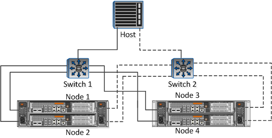

= Füllen Sie das FC-Konfigurationsarbeitsblatt aus
:allow-uri-read: 
:icons: font
:imagesdir: ../media/

[role="lead"]
Sie benötigen FC-Initiator- und Ziel-WWPNs sowie Informationen zur Storage-Konfiguration, um FC-Konfigurationsaufgaben durchzuführen.

== FC-Host-WWPNs

|===
| Port | WWPN 

 a| 
Initiator-Port (Host) ist mit FC-Switch 1 verbunden
 a| 

 a| 
Initiator (Host) Port verbunden mit FC-Switch 2
 a| 

|===

== FC Ziel-WWPNs

Sie benötigen für jeden Node im Cluster zwei FC-Daten-LIFs. Die WWPNs werden von ONTAP zugewiesen, wenn Sie die LIFs beim Erstellen der Storage Virtual Machine (SVM) erstellen.

|===
| LIF | WWPN 

 a| 
Node 1 LIF mit Anschluss an FC-Switch 1
 a| 

 a| 
Node 2 LIF mit Anschluss an FC-Switch 1
 a| 

 a| 
Node 3 LIF mit Anschluss an FC Switch 1
 a| 

 a| 
LIF auf Node 4 mit Port, der mit FC-Switch 1 verbunden ist
 a| 

 a| 
LIF auf Node 1 mit Port, der mit FC-Switch 2 verbunden ist
 a| 

 a| 
LIF auf Node 2 mit Port, der mit FC-Switch 2 verbunden ist
 a| 

 a| 
LIF auf Node 3 mit Port, der mit FC-Switch 2 verbunden ist
 a| 

 a| 
LIF auf Node 4 mit Port, der mit FC-Switch 2 verbunden ist
 a| 

|===

== Storage-Konfiguration

Wenn das Aggregat und die SVM bereits erstellt sind, notieren Sie hier ihre Namen. Andernfalls können Sie sie nach Bedarf erstellen:

|===
| Node zu eigener LUN 

 a| 
Aggregatname

 a| 
SVM-Name

|===

== LUN-Informationen

|===
| Die LUN-Größe 

 a| 
Host-Betriebssystem

 a| 
LUN-Name (optional)

 a| 
LUN-Beschreibung (optional)

|===

== SVM-Informationen

Falls Sie keine vorhandene SVM verwenden, müssen Sie für die Erstellung einer neuen SVM die folgenden Informationen benötigen:

[cols="1a,1a"]
|===
2+| SVM-Name 

 a| 
IP-Speicherplatz für SVM

 a| 
Aggregat für SVM Root-Volume

 a| 
SVM-Benutzername (optional)

 a| 
SVM-Passwort (optional)

 a| 
SVM-Management-LIF (optional)

 a| 
 a| 
Subnetz:

 a| 
 a| 
IP-Adresse:

 a| 
 a| 
Netzwerkmaske:

 a| 
 a| 
Gateway:

 a| 
 a| 
Home-Node:

 a| 
 a| 
Startanschluss:

|===