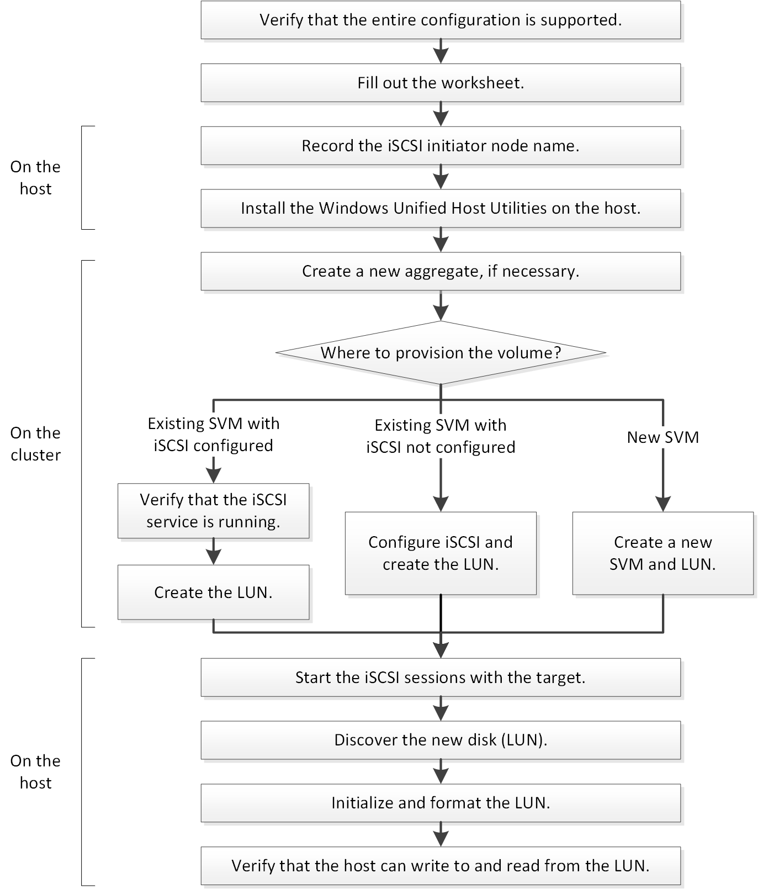

= ISCSI-Konfigurations- und Bereitstellungs-Workflow
:allow-uri-read: 
:icons: font
:imagesdir: ../media/

[role="lead"]
Wenn Sie Storage über iSCSI für einen Host zur Verfügung stellen, stellen Sie auf der Storage Virtual Machine (SVM) ein Volume und eine LUN bereit. Anschließend stellen Sie über den Host eine Verbindung zur LUN her.

