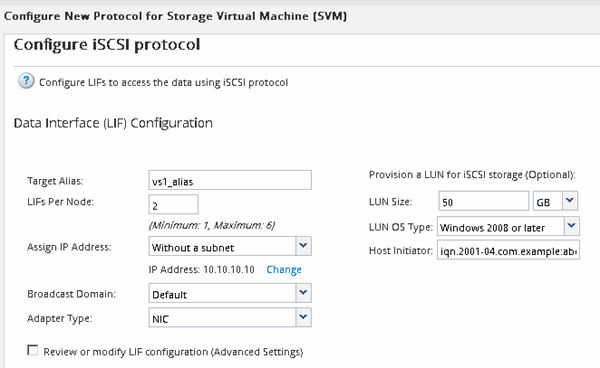

= Konfigurieren Sie iSCSI auf einer vorhandenen SVM
:allow-uri-read: 
:icons: font
:imagesdir: ../media/

[role="lead"]
Sie können iSCSI auf einer vorhandenen Storage Virtual Machine (SVM) konfigurieren und mit einem einzigen Assistenten eine LUN und das zugehörige Volume erstellen. Das iSCSI-Protokoll muss bereits aktiviert, aber nicht auf der SVM konfiguriert sein. Diese Information richtet sich an SVMs, für die Sie mehrere Protokolle konfigurieren, iSCSI jedoch noch nicht konfiguriert sind.

.Bevor Sie beginnen
Sie müssen über genügend Netzwerkadressen verfügen, um für jeden Node zwei LIFs zu erstellen.

.Über diese Aufgabe
LUNs sind einem Teil der Initiatoren in der Initiatorgruppe zugeordnet, um die Anzahl der Pfade vom Host auf die LUN zu begrenzen.

* ONTAP verwendet eine selektive LUN-Zuordnung (Selective LUN Map, SLM), um die LUN nur durch Pfade auf dem Node, der die LUN und deren HA-Partner besitzt, zugänglich zu machen.
* Für LUN-Mobilität müssen Sie weiterhin alle iSCSI LIFs auf jedem Node konfigurieren, falls die LUN auf einen anderen Node im Cluster verschoben wird.
* Sie müssen die Liste der SLM Reporting-Nodes ändern, bevor Sie ein Volume oder eine LUN verschieben.

.Schritte
. Navigieren Sie zum Fenster *SVMs*.
. Wählen Sie die SVM aus, die Sie konfigurieren möchten.
. Stellen Sie im Fenster SVM**Details** sicher, dass *iSCSI* mit einem grauen Hintergrund angezeigt wird. Dies bedeutet, dass das Protokoll aktiviert, aber nicht vollständig konfiguriert ist.
+
Wenn *iSCSI* mit grünem Hintergrund angezeigt wird, ist die SVM bereits konfiguriert.

+
image::../media/existing_svm_protocols_iscsi_windows.gif[Bild zeigt die Detailseite mit allen vier Protokollen mit grauem Hintergrund.]

. Klicken Sie auf den Protokolllink *iSCSI* mit dem grauen Hintergrund.
+
Das Fenster iSCSI-Protokoll konfigurieren wird angezeigt.

. Konfigurieren Sie den iSCSI-Service und die LIFs auf der Seite *iSCSI-Protokoll konfigurieren*:
+
.. Geben Sie einen Alias-Namen für das Ziel ein.
.. Eingabe `*2*` Im Feld *LIFs pro Node*.
+
Für jeden Node sind zwei LIFs erforderlich, um Verfügbarkeit und Datenmobilität zu gewährleisten.

.. Weisen Sie den LIFs IP-Adressen entweder mit einem Subnetz oder ohne Subnetz zu.
.. Geben Sie im Bereich *LUN bereitstellen für iSCSI-Speicher* die gewünschte LUN-Größe, den Host-Typ und den iSCSI-Initiatornamen des Hosts ein.
.. Klicken Sie Auf *Absenden & Schließen*.

+

. Überprüfen Sie die Seite *Zusammenfassung*, notieren Sie die LIF-Informationen und klicken Sie dann auf *OK*.

