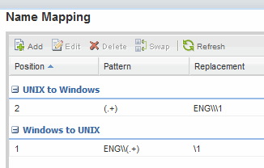

= Weisen Sie UNIX- und Windows-Benutzernamen zu
:allow-uri-read: 
:icons: font
:imagesdir: ../media/

[role="lead"]
Wenn Ihre Site sowohl Windows- als auch UNIX-Benutzerkonten umfasst, sollten Sie die Namenszuordnung verwenden, um sicherzustellen, dass Windows-Benutzer mit UNIX-Dateiberechtigungen auf Dateien zugreifen können und dass UNIX-Benutzer mit NTFS-Dateiberechtigungen auf Dateien zugreifen können. Das NamensMapping kann eine beliebige Kombination von impliziten Zuordnungen, Konvertierungsregeln und Standardbenutzern umfassen.

.Über diese Aufgabe
Sie sollten dieses Verfahren nur verwenden, wenn auf Ihrer Site Windows- und UNIX-Benutzerkonten vorhanden sind, die nicht implizit zugeordnet werden können, d. h. wenn die Kleinbuchstaben der einzelnen Windows-Benutzernamen mit dem UNIX-Benutzernamen übereinstimmen. Dies kann mit NIS, LDAP oder lokalen Benutzern erfolgen. Wenn Sie zwei Gruppen von Benutzern haben, die nicht übereinstimmen, sollten Sie die Namenszuordnung konfigurieren.

.Schritte
. Entscheiden Sie sich für eine Methode der Namenszuordnungen - Umrechnungsregeln für das Namenszuordnungen, Standard-Benutzerzuordnungen oder beides -, indem Sie die folgenden Faktoren berücksichtigen:
+
** Konvertierungsregeln Verwenden Sie reguläre Ausdrücke, um einen Benutzernamen in einen anderen zu konvertieren, was nützlich ist, wenn Sie den Zugriff auf einer individuellen Ebene steuern oder verfolgen möchten.
+
Zum Beispiel können Sie UNIX-Benutzer Windows-Benutzern in einer Domäne zuordnen und umgekehrt.

** Standardbenutzer ermöglichen es Ihnen, allen Benutzern, die nicht durch implizite Zuordnungen oder Konvertierungsregeln für die Namenszuweisung zugeordnet sind, einen Benutzernamen zuzuweisen.
+
Jede SVM hat einen UNIX-Standardbenutzer namens „`pcuser`“, hat aber keinen standardmäßigen Windows-Benutzer.

. Navigieren Sie zum Fenster *SVMs*.
. Wählen Sie die SVM aus, die Sie konfigurieren möchten.
. Klicken Sie auf die Registerkarte *SVM Settings*.
. *Optional*: Erstellen Sie eine Namenszuordnung, die UNIX-Benutzerkonten in Windows-Benutzerkonten konvertiert und umgekehrt:
+
.. Klicken Sie im Fensterbereich *Host-Benutzer und Gruppen* auf *Namenszuordnung*.
.. Klicken Sie auf *Hinzufügen*, behalten Sie die Standard *Windows auf UNIX*-Richtung und erstellen Sie dann einen regulären Ausdruck, der eine UNIX-Berechtigung erzeugt, wenn ein Windows-Benutzer versucht, auf eine Datei zuzugreifen, die UNIX-Dateiberechtigungen verwendet.
+
Verwenden Sie den folgenden Eintrag, um jeden Windows-Benutzer in der eng-Domäne in einen UNIX-Benutzer mit demselben Namen zu konvertieren. Das Muster `ENG\\(.+)` Sucht einen beliebigen Windows-Benutzernamen mit dem Präfix `ENG\\`, Und der Ersatz `\1` Erstellt die UNIX-Version, indem alles außer dem Benutzernamen entfernt wird.

+
image::../media/name_mappings_1_windows_to_unix.gif[Screenshot eines Windows-to-UNIX-Eintrags]

.. Klicken Sie auf**Hinzufügen**, wählen Sie die Richtung *UNIX zu Windows* und erstellen Sie dann das entsprechende Mapping, das eine Windows-Anmeldeinformationen erzeugt, wenn ein UNIX-Benutzer versucht, auf eine Datei zuzugreifen, die NTFS-Dateiberechtigungen hat.
+
Verwenden Sie den folgenden Eintrag, um jeden UNIX-Benutzer in einen Windows-Benutzer mit dem gleichen Namen in der eng-Domain zu konvertieren. Das Muster `(.+)` Sucht nach einem beliebigen UNIX-Namen und dem Ersatz `ENG\\\1` Erstellt die Windows-Version durch Einfügen `ENG\\` Vor dem Benutzernamen.

+
image::../media/name_mappings_2_unix_to_windows.gif[Screenshot eines UNIX-to-Windows Eintrags]

.. Da die Position jeder Regel die Reihenfolge bestimmt, in der die Regeln angewendet werden, sollten Sie das Ergebnis überprüfen und bestätigen, dass die Bestellung Ihren Erwartungen entspricht.
+

.. Wiederholen Sie die Schritte 5b bis 5d, um alle Domänen und Namen der SVM zuzuordnen.

. *Optional*: Erstellen Sie einen Windows-Standardbenutzer:
+
.. Erstellen Sie ein Windows-Benutzerkonto in LDAP, NIS oder den lokalen Benutzern der SVM.
+
Wenn Sie lokale Benutzer verwenden, können Sie unter *Windows* im Bereich Host-Benutzer und -Gruppen ein Konto erstellen.

.. Legen Sie den Windows-Standardbenutzer fest, indem Sie im Fenster *Protokolle* *NFS* > *Bearbeiten* und den Benutzernamen eingeben.

+
Sie können einen lokalen Windows-Benutzer mit dem Namen „`unixUsers`“ erstellen und diesen als den Windows-Standardbenutzer festlegen.

. *Optional*: Konfigurieren Sie den Standard-UNIX-Benutzer, wenn Sie einen anderen Benutzer als den Standardwert wünschen, d. h. den Benutzer „`pcuser`“.
+
.. Erstellen Sie ein UNIX-Benutzerkonto in LDAP, NIS oder den lokalen Benutzern der SVM.
+
Wenn Sie lokale Benutzer verwenden, können Sie unter *UNIX* im Bereich Host-Benutzer und -Gruppen ein Konto erstellen.

.. Legen Sie den Standard-UNIX-Benutzer fest, indem Sie im Fenster *Protokolle* *CIFS* > *Optionen* und den Benutzernamen eingeben.

+
Sie können einen lokalen UNIX-Benutzer mit dem Namen „`winUsers`“ erstellen und ihn als Standard-UNIX-Benutzer festlegen.

== Nächste Schritte

Wenn Sie Standardbenutzer konfiguriert haben, sollten Sie beim späteren Konfigurieren von Dateiberechtigungen im Workflow Berechtigungen für den standardmäßigen Windows-Benutzer und den UNIX-Standardbenutzer festlegen.
