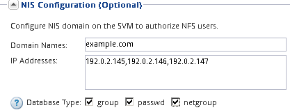

= Fügen Sie einer vorhandenen SVM NFS-Zugriff hinzu
:allow-uri-read: 
:icons: font
:imagesdir: ../media/

[role="lead"]
Beim Hinzufügen eines NFS-Zugriffs für eine vorhandene SVM müssen eine Daten-LIF erstellt, optional NIS konfiguriert, Volumes bereitgestellt, Volume exportiert und die Exportrichtlinie konfiguriert werden.

.Bevor Sie beginnen
* Sie müssen wissen, welche der folgenden Netzwerkkomponenten die SVM verwendet:
+
** Der Node und der spezifische Port auf diesem Node, auf dem die logische Datenschnittstelle (LIF) erstellt wird
** Das Subnetz, aus dem die IP-Adresse der Daten-LIF bereitgestellt wird, oder optional die spezifische IP-Adresse, die Sie der Daten-LIF zuweisen möchten

* Alle externen Firewalls müssen entsprechend konfiguriert sein, um den Zugriff auf Netzwerkdienste zu ermöglichen.
* Das NFS-Protokoll muss auf der SVM zugelassen sein.

Weitere Informationen finden Sie im link:https://docs.netapp.com/us-en/ontap/networking/index.html["Dokumentation des Netzwerkmanagements"^].

.Schritte
. Navigieren Sie zu dem Bereich, in dem Sie die Protokolle der SVM konfigurieren können:
+
.. Wählen Sie die SVM aus, die Sie konfigurieren möchten.
.. Klicken Sie im Fensterbereich *Details* neben *Protokollen* auf *NFS*.
+
image::../media/svm_add_protocol_nfs_nfs.gif[Dieses Bild wird durch den umgebenden Text erläutert.]

. Erstellen Sie im Dialogfeld * NFS-Protokoll konfigurieren* eine Daten-LIF.
+
.. Weisen Sie der LIF automatisch aus einem Subnetz zu, das Sie angeben oder manuell eingeben.
.. Klicken Sie auf *Durchsuchen* und wählen Sie einen Knoten und Port aus, der der logischen Schnittstelle zugeordnet werden soll.
+
image::../media/svm_setup_cifs_nfs_page_lif_multi_nas_nfs.gif[Diese Grafik wird durch den umgebenden Text beschrieben.]

. Wenn Ihre Site NIS für Namensdienste oder Namenszuordnungen verwendet, geben Sie die Domänen- und IP-Adressen der NIS-Server an und wählen Sie die Datenbanktypen aus, für die Sie die NIS-Namensservice-Quelle hinzufügen möchten.
+

+
Wenn keine NIS-Dienste verfügbar sind, versuchen Sie nicht, sie zu konfigurieren. Falsch konfigurierte NIS-Services können zu Problemen beim Zugriff auf Datenspeicher führen.

. Erstellen und Exportieren eines Volumes für NFS-Zugriff:
+
.. Geben Sie für *Exportname* einen Namen ein, der sowohl der Exportname als auch der Anfang des Volume-Namens sein wird.
.. Geben Sie eine Größe für das Volume an, das die Dateien enthalten soll.
+
image::../media/svm_setup_cifs_nfs_page_nfs_export_nfs.gif[Screenshot des Bereichs, in dem Sie den NFS-Export konfigurieren]

+
Sie müssen das Aggregat für das Volume nicht angeben, da es sich automatisch auf dem Aggregat mit dem meisten verfügbaren Speicherplatz befindet.

.. Klicken Sie im Feld *Berechtigung* auf *Ändern* und geben Sie eine Exportregel an, die NFSv3-Zugriff auf einen UNIX-Administrationshost, einschließlich Superuser-Zugriff, gibt.
+
image::../media/export_rule_for_admin_manual_nfs_nfs.gif[Dieses Bild wird durch den umgebenden Text erläutert.]

+
Sie können ein 10-GB-Volume mit dem Namen „eng“ erstellen, es als „eng“ exportieren und eine Regel hinzufügen, die dem „`admin_Host`“-Client vollständigen Zugriff auf den Export gibt, einschließlich Superuser-Zugriff.

. Klicken Sie auf *Absenden & Schließen* und dann auf *OK*.

