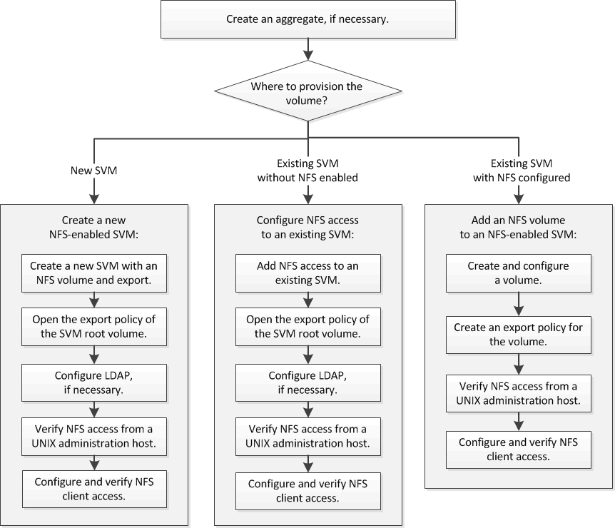

= NFS-Konfigurationsworkflow
:allow-uri-read: 
:icons: font
:imagesdir: ../media/

[role="lead"]
Bei der Konfiguration von NFS müssen optional ein Aggregat erstellt und anschließend ein Workflow ausgewählt werden, der auf Ihre Zielvorgabe zugeschnitten ist: Erstellung einer neuen SVM mit NFS-Aktivierung, Konfiguration des NFS-Zugriffs auf eine vorhandene SVM oder das Hinzufügen eines NFS-Volumes zu einer vorhandenen SVM, die bereits vollständig für NFS-Zugriff konfiguriert ist.

