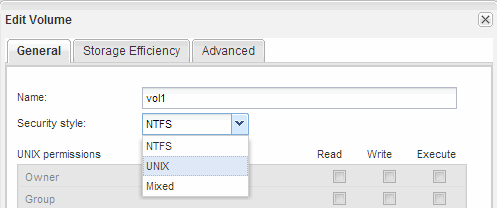

= Erstellung und Konfiguration eines Volume
:allow-uri-read: 
:icons: font
:imagesdir: ../media/

[role="lead"]
Sie müssen ein FlexVol Volume erstellen, damit diese Ihre Daten enthält. Optional können Sie den Standardsicherheitsstil des Volumes ändern, der vom Sicherheitsstil des Root-Volumes übernommen wird. Optional können Sie auch den Standardspeicherort des Volumes im Namespace ändern, der sich im Root-Volume der SVM (Storage Virtual Machine) befindet.

.Schritte
. Navigieren Sie zum Fenster *Volumes*.
. Klicken Sie auf *Erstellen* > *FlexVol erstellen*.
+
Das Dialogfeld Volume erstellen wird angezeigt.

. Wenn Sie den Standardnamen ändern möchten, der mit einem Datum- und Zeitstempel endet, geben Sie einen neuen Namen an, z. B. `vol1`.
. Wählen Sie ein Aggregat für das Volume aus.
. Geben Sie die Größe des Volumes an.
. Klicken Sie Auf *Erstellen*.
+
Jedes in System Manager erstellte neue Volume wird standardmäßig auf dem Root-Volume gemountet. Dabei wird der Volume-Name als Verbindungspame verwendet. NFS Clients verwenden beim Mounten des Volume den Verbindungspfad und den Verbindungsnamen.

. Wenn sich das Volume nicht im Root-Verzeichnis der SVM befinden soll, ändern Sie den Speicherort des neuen Volumes im vorhandenen Namespace:
+
.. Navigieren Sie zum Fenster *Namespace*.
.. Wählen Sie im Dropdown-Menü die Option *SVM* aus.
.. Klicken Sie Auf *Mount*.
.. Geben Sie im Dialogfeld *Mount Volume* das Volume, den Namen des Verbindungspfades und den Verbindungspfad an, auf dem das Volume angehängt werden soll.
.. Überprüfen Sie den neuen Verbindungspfad im Fenster *Namespace*.
+
Falls Sie bestimmte Volumes unter dem Hauptvolume „`data`“ organisieren möchten, können Sie das neue Volume „`vol1`“ vom Root-Volume auf das „`data`“-Volume verschieben.

+
image::../media/namespace_1_before_nfs.gif[Diese Grafik wird durch den umgebenden Text beschrieben.]

. Überprüfen Sie den Sicherheitsstil des Volumes, und ändern Sie ihn ggf.:
+
.. Wählen Sie im Fenster *Volume* den gerade erstellten Datenträger aus und klicken Sie auf *Bearbeiten*.
+
Das Dialogfeld Volume bearbeiten wird angezeigt und zeigt den aktuellen Sicherheitsstil des Volumes an, der vom Sicherheitstyp des SVM-Root-Volumes übernommen wurde.

.. Stellen Sie sicher, dass der Sicherheitsstil UNIX ist.
+

