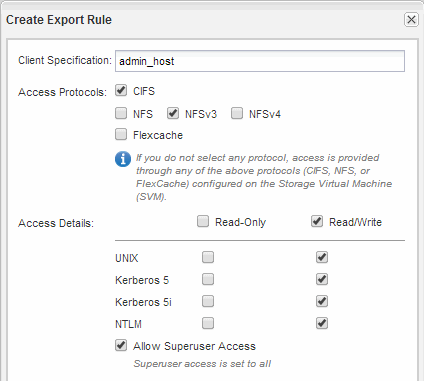

= Exportrichtlinie für das Volume erstellen
:allow-uri-read: 
:icons: font
:imagesdir: ../media/

[role="lead"]
Bevor NFS-Clients auf ein Volume zugreifen können, müssen Sie eine Exportrichtlinie für das Volume erstellen, eine Regel hinzufügen, die den Zugriff durch einen Administrationshost ermöglicht, und die neue Exportrichtlinie auf das Volume anwenden.

.Schritte
. Navigieren Sie zum Fenster *SVMs*.
. Klicken Sie auf die Registerkarte *SVM Settings*.
. Neue Exportrichtlinie erstellen:
+
.. Klicken Sie im Fensterbereich *Richtlinien* auf *Richtlinien exportieren* und dann auf *Erstellen*.
.. Geben Sie im Fenster *Exportrichtlinie erstellen* einen Richtliniennamen an.
.. Klicken Sie unter *Exportregeln* auf *Hinzufügen*, um der neuen Richtlinie eine Regel hinzuzufügen.

+
image::../media/export_policy_create_nfs.gif[Dieser Screenshot wird durch den vorhergehenden Text beschrieben.]

. Erstellen Sie im Dialogfeld *Exportregel erstellen* eine Regel, die einem Administrator vollen Zugriff auf den Export über alle Protokolle ermöglicht:
+
.. Geben Sie die IP-Adresse oder den Clientnamen an, z. B. admin_Host, von dem das exportierte Volume verwaltet wird.
.. Wählen Sie *NFSv3* aus.
.. Stellen Sie sicher, dass alle *Lesen/Schreiben* Zugriffsdaten ausgewählt sind, sowie *Superuser Access zulassen*.
+

.. Klicken Sie auf *OK* und dann auf *Erstellen*.

+
Die neue Exportrichtlinie wird zusammen mit ihrer neuen Regel erstellt.

. Wenden Sie die neue Exportrichtlinie auf das neue Volume an, damit der Administratorhost auf das Volume zugreifen kann:
+
.. Navigieren Sie zum Fenster *Namespace*.
.. Wählen Sie das Volume aus und klicken Sie auf *Exportrichtlinie ändern*.
.. Wählen Sie die neue Richtlinie aus und klicken Sie auf *Ändern*.

*Verwandte Informationen*

xref:task_verifying_nfs_access_from_unix_administration_host.adoc[Überprüfen des NFS-Zugriffs von einem UNIX Administrationshost aus]
