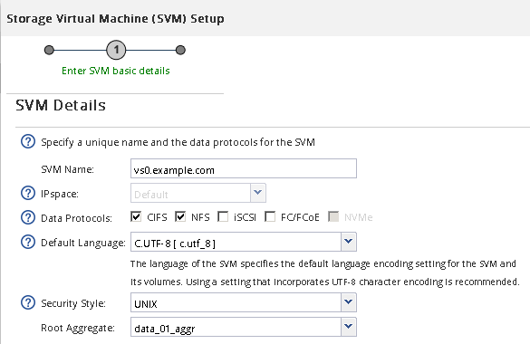

= Erstellung einer neuen SVM mit NFS-Volume und Export
:allow-uri-read: 
:icons: font
:imagesdir: ../media/

[role="lead"]
Sie können einen Assistenten verwenden, der Sie beim Erstellen der Storage Virtual Machine (SVM), beim Konfigurieren des Domain Name System (DNS), beim Erstellen einer logischen Datenschnittstelle (LIF), beim Aktivieren von NFS, bei optional dem Konfigurieren von NIS und beim Erstellen und Exportieren eines Volumes unterstützt.

.Bevor Sie beginnen
* Ihr Netzwerk muss konfiguriert und die entsprechenden physischen Ports mit dem Netzwerk verbunden sein.
* Sie müssen wissen, welche der folgenden Netzwerkkomponenten die SVM verwendet:
+
** Der Node und der spezifische Port auf diesem Node, auf dem die logische Datenschnittstelle (LIF) erstellt wird
** Das Subnetz, aus dem die IP-Adresse der Daten-LIF bereitgestellt wird, oder optional die spezifische IP-Adresse, die Sie der Daten-LIF zuweisen möchten
** NIS-Informationen, wenn Ihre Website NIS für Namensdienste oder Namenszuordnungen verwendet

* Das Subnetz muss für alle externen Server, die für Dienste wie NIS (Network Information Service), Lightweight Directory Access Protocol (LDAP), Active Directory (AD) und DNS erforderlich sind, routingfähig sein.
* Alle externen Firewalls müssen entsprechend konfiguriert sein, um den Zugriff auf Netzwerkdienste zu ermöglichen.
* Die Zeit auf den AD-Domänencontrollern, -Clients und -SVMs müssen so innerhalb von fünf Minuten synchronisiert werden.

.Schritte
. Navigieren Sie zum Fenster *SVMs*.
. Klicken Sie Auf *Erstellen.*
. Erstellen Sie im Dialogfeld *Storage Virtual Machine (SVM) Setup* die SVM:
+
.. Geben Sie einen eindeutigen Namen für die SVM an.
+
Der Name muss entweder ein vollständig qualifizierter Domänenname (FQDN) sein oder einer anderen Konvention folgen, die eindeutige Namen in einem Cluster sicherstellt.

.. Wählen Sie alle Protokolle aus, für die Sie Lizenzen haben, und dass Sie danach auf der SVM verwenden werden, auch wenn Sie nicht alle Protokolle sofort konfigurieren möchten.
+
Wenn CIFS Zugang irgendwann erforderlich ist, müssen Sie *CIFS* jetzt auswählen, damit CIFS und NFS Clients die gleiche Daten-LIF teilen können.

.. Behalten Sie die Standardeinstellung C.UTF-8 bei.
+
[NOTE]
====
Wenn Sie die internationale Zeichenanzeige sowohl bei NFS- als auch bei SMB/CIFS-Clients unterstützen, sollten Sie den Sprachcode *UTF8MB4* verwenden, der ab ONTAP 9.5 verfügbar ist.

====
+
Diese Sprache wird von dem Volume übernommen, das Sie später erstellen, und die Sprache eines Volumes kann nicht geändert werden.

.. *Optional*: Wenn Sie das CIFS-Protokoll aktiviert haben, ändern Sie den Sicherheitsstil in *UNIX*.
+
Wenn Sie das CIFS-Protokoll auswählen, wird der Sicherheitsstil standardmäßig auf NTFS festgelegt.

.. *Optional*: Wählen Sie das Root-Aggregat aus, das das SVM Root Volume enthält.
+
Das Aggregat, das Sie für das Root-Volume auswählen, bestimmt nicht den Speicherort des Daten-Volumes. Das Aggregat für das Daten-Volume wird automatisch ausgewählt, wenn Sie später Storage bereitstellen.

+

.. Stellen Sie im Bereich *DNS Configuration* sicher, dass die Standard-DNS-Suchdomäne und Namensserver die für diese SVM zu verwenden sind.
+
image::../media/svm_setup_details_dns_nfs.gif[Diese Grafik wird durch den umgebenden Text erläutert.]

.. Klicken Sie Auf *Absenden & Fortfahren*.

+
Die SVM wird erstellt, die Protokolle sind jedoch noch nicht konfiguriert.

. Geben Sie im Abschnitt *Data LIF Configuration* der Seite *Configure CIFS/NFS Protocol* die Details der logischen Schnittstelle an, die Clients für den Datenzugriff verwenden:
+
.. Weisen Sie der LIF automatisch aus einem Subnetz zu, das Sie angeben oder manuell eingeben.
.. Klicken Sie auf *Durchsuchen* und wählen Sie einen Knoten und Port aus, der der logischen Schnittstelle zugeordnet werden soll.
+
image::../media/svm_setup_cifs_nfs_page_lif_multi_nas_nfs.gif[Diese Grafik wird durch den umgebenden Text beschrieben.]

. Wenn der Bereich *NIS Configuration* ausgeblendet ist, erweitern Sie ihn.
. Wenn Ihre Site NIS für Namensdienste oder Namenszuordnungen verwendet, geben Sie die Domain und die IP-Adressen der NIS-Server an.
+
image::../media/svm_setup_cifs_nfs_page_nis_area_nfs.gif[Diese Grafik wird durch den umgebenden Text erläutert.]

. Erstellen und Exportieren eines Volumes für NFS-Zugriff:
+
.. Geben Sie für *Exportname* einen Namen ein, der sowohl der Exportname als auch der Anfang des Volume-Namens sein wird.
.. Geben Sie eine Größe für das Volume an, das die Dateien enthalten soll.
+
image::../media/svm_setup_cifs_nfs_page_nfs_export_nfs.gif[Screenshot des Bereichs, in dem Sie den NFS-Export konfigurieren]

+
Sie müssen das Aggregat für das Volume nicht angeben, da es sich automatisch auf dem Aggregat mit dem meisten verfügbaren Speicherplatz befindet.

.. Klicken Sie im Feld *Berechtigung* auf *Ändern* und geben Sie eine Exportregel an, die NFSv3-Zugriff auf einen UNIX-Administrationshost, einschließlich Superuser-Zugriff, gibt.
+
image::../media/export_rule_for_admin_manual_nfs_nfs.gif[Dieses Bild wird durch den umgebenden Text erläutert.]

+
Sie können ein 10-GB-Volume mit dem Namen „eng“ erstellen, es als „eng“ exportieren und eine Regel hinzufügen, die dem „`admin_Host`“-Client vollständigen Zugriff auf den Export gibt, einschließlich Superuser-Zugriff.

. Klicken Sie Auf *Absenden & Fortfahren*.
+
Folgende Objekte werden erstellt:

+
** Eine Daten-LIF namens nach der SVM mit dem Suffix „`_nfs_lif1`“
** Einen NFS-Server
** Ein Volume, das sich auf dem Aggregat mit dem meisten verfügbaren Speicherplatz befindet und über einen Namen verfügt, der dem Namen des Exports entspricht und im Suffix „`_NFS_Volume`“ endet
** Ein Export für das Volume
** Eine Exportrichtlinie mit dem gleichen Namen wie der Export

. Klicken Sie bei allen anderen angezeigten Protokollkonfigurationsseiten auf *Skip* und konfigurieren Sie das Protokoll später.
. Wenn die Seite *SVM Administration* angezeigt wird, konfigurieren oder verschieben Sie die Konfiguration eines separaten Administrators für diese SVM:
+
** Klicken Sie auf *Überspringen* und konfigurieren Sie einen Administrator später, falls erforderlich.
** Geben Sie die gewünschten Informationen ein und klicken Sie dann auf *Absenden & Fortfahren*.

. Überprüfen Sie die Seite *Zusammenfassung*, notieren Sie alle Informationen, die Sie später benötigen, und klicken Sie dann auf *OK*.
+
NFS Clients müssen die IP-Adresse der Daten-LIF kennen.

.Ergebnisse
Eine neue SVM wird mit einem NFS-Server erstellt, der ein neues Volume enthält, das für einen Administrator exportiert wird.
