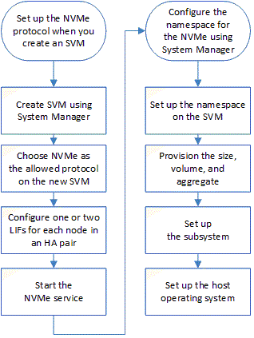

= Richten Sie NVMe mit System Manager – ONTAP 9.7 und früher ein
:allow-uri-read: 
:icons: font
:imagesdir: ../media/

[role="lead"]
Verwenden Sie ONTAP System Manager Classic (verfügbar in ONTAP 9.7 und älter), um das NVMe-Protokoll für eine SVM einzurichten. Wenn das NVMe-Protokoll auf der SVM aktiviert ist, können Sie einen Namespace oder Namespaces bereitstellen und diesen einem Host und einem Subsystem zuweisen.

Ab ONTAP 9.5 müssen Sie mindestens eine NVMe-LIF pro Node in einem HA-Paar konfigurieren, das das NVMe-Protokoll verwendet. Sie können außerdem maximal zwei NVMe LIFs pro Node definieren. Sie konfigurieren die NVMe-LIFs, wenn Sie die SVM-Einstellungen mit System Manager erstellen oder bearbeiten.

Die folgende Abbildung zeigt den Workflow zur Einrichtung von NVMe:

