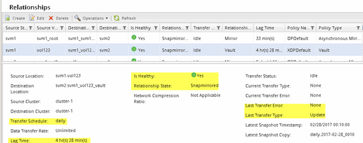

= Überwachen der SnapVault Beziehung
:allow-uri-read: 
:icons: font
:imagesdir: ../media/

[role="lead"]
Sie sollten den Status der SnapVault-Beziehungen regelmäßig überwachen, um sicherzustellen, dass die Daten gemäß dem festgelegten Zeitplan auf dem Ziel-Volume gesichert werden.

.Über diese Aufgabe
Sie müssen diese Aufgabe aus dem Cluster *Ziel* ausführen.

.Schritte
. Führen Sie je nach der verwendeten System Manager-Version einen der folgenden Schritte aus:
+
** ONTAP 9.4 oder früher: Klicken Sie *Schutz* > *Beziehungen*.
** Ab ONTAP 9.5: Klicken Sie *Schutz* > *Volume Relationships*.

. Wählen Sie die SnapVault-Beziehung zwischen Quell- und Ziel-Volumes aus, und überprüfen Sie dann den Status auf der Registerkarte *Details* Bottom.
+
Der Integritätsstatus der SnapVault-Beziehung, alle Übertragungsfehler und die Verzögerungszeit werden angezeigt:

+
** Das Feld ist in Zustand muss angezeigt werden `Yes`.
+
Bei den meisten Datenübertragungsfehlern wird das Feld angezeigt `No`. In einigen Fehlerfällen wird das Feld jedoch weiterhin angezeigt `Yes`. Sie müssen die Übertragungsfehler im Abschnitt Details überprüfen, um sicherzustellen, dass keine Datenübertragung fehlgeschlagen ist.

** Das Feld „Beziehungsstatus“ muss angezeigt werden `Snapmirrored`.
** Die Verzögerung darf nicht größer sein als das Transferplanintervall.
+
Wenn der Transferzeitplan z. B. täglich ist, darf die Verzögerungszeit nicht mehr als einen Tag lang sein.

+
Sie sollten Probleme in den SnapVault Beziehungen beheben. Die Fehlerbehebungsschritte für SnapMirror Beziehungen gelten auch für SnapVault Beziehungen.

+
http://www.netapp.com/us/media/tr-4015.pdf["Technischer Bericht 4015: SnapMirror Configuration and Best Practices for ONTAP 9.1, 9.2"^]

+

