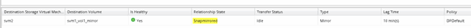

= SnapMirror Beziehung erstellen (ONTAP 9.2 oder älter)
:allow-uri-read: 
:icons: font
:imagesdir: ../media/

[role="lead"]
Sie müssen eine SnapMirror Beziehung zwischen dem Quell-Volume auf einem Cluster und dem Ziel-Volume auf dem Peering Cluster erstellen, um die Daten für Disaster Recovery zu replizieren.

.Bevor Sie beginnen
* Sie müssen über den Benutzernamen und das Passwort des Cluster-Administrators für das Ziel-Cluster verfügen.
* Das Zielaggregat muss über verfügbaren Platz verfügen.
* Beide Cluster müssen entsprechend konfiguriert und eingerichtet werden, um die Anforderungen Ihrer Umgebung für Benutzerzugriff, Authentifizierung und Client-Zugriff zu erfüllen.

.Über diese Aufgabe
Sie müssen diese Aufgabe aus dem Cluster *source* ausführen.

.Schritte
. Klicken Sie auf *Storage* > *SVMs*.
. Wählen Sie die SVM aus, und klicken Sie dann auf *SVM Settings*.
. Klicken Sie auf die Registerkarte *Volumes*.
. Wählen Sie das Volume aus, für das Sie eine Spiegelbeziehung erstellen möchten, und klicken Sie dann auf *Protect*.
+
Das Fenster Schutzbeziehung erstellen wird angezeigt.

. Wählen Sie im Abschnitt *Beziehungstyp* aus der Dropdown-Liste *Beziehungstyp* die Option *Spiegel* aus.
. Wählen Sie im Abschnitt *Zielvolume* den Peered Cluster aus.
. Legen Sie die SVM für das Ziel-Volume fest:
+
|===
| Lautet die SVM... | Dann... 

 a| 
Peered
 a| 
Wählen Sie aus der Liste die Peering SVM aus.

 a| 
Keine Peered
 a| 
.. Wählen Sie die SVM aus.
.. Klicken Sie Auf *Authentifizieren*.
.. Geben Sie die Anmeldedaten des Clusteradministrators für den Peering Cluster ein, und klicken Sie dann auf *Create*.

|===
. Neues Ziel-Volume erstellen:
+
.. Wählen Sie die Option *New Volume*.
.. Verwenden Sie den Standard-Volume-Namen, oder geben Sie einen neuen Volume-Namen an.
.. Wählen Sie das Zielaggregat aus.

+
image::../media/destination_volume_settings.gif[Einstellungen für das Ziel-Volume]

. Wählen Sie im Abschnitt *Konfigurationsdetails* die Option *MirrorAllSnapshot* als Spiegelrichtlinie aus.
+
`DPDefault` Und `MirrorLatest` Sind die anderen standardmäßigen Spiegelungsrichtlinien, die für SnapMirror Beziehungen verfügbar sind.

. Wählen Sie einen Schutzplan aus der Liste der Zeitpläne aus.
. Stellen Sie sicher, dass das Kontrollkästchen *Beziehung initialisieren* aktiviert ist, und klicken Sie dann auf *Erstellen*.
+
Durch Initialisieren der SnapMirror Beziehung wird sichergestellt, dass das Ziel-Volume über eine Baseline zum Sichern des Quell-Volume verfügt.

+
image::../media/create_snapmirror_relationship_window.gif[SnapMirror Fenster erstellen]

+
Die Beziehung wird initialisiert durch einen Basistransfer der Daten vom Quell-Volume zum Ziel-Volume.

+
Der Initialisierungsvorgang kann einige Zeit in Anspruch nehmen. Im Abschnitt Status wird der Status jedes Jobs angezeigt.

+
image::../media/snapmirror_create_3_successful.gif[Erstellung von SnapMirror erfolgreich]

. Überprüfen Sie den Beziehungsstatus der SnapMirror Beziehung:
+
.. Wählen Sie das Volume aus, für das Sie die SnapMirror-Beziehung aus der Liste *Volumes* erstellt haben, und klicken Sie dann auf *Data Protection*.
.. Überprüfen Sie auf der Registerkarte *Data Protection*, ob die von Ihnen erstellte SnapMirror-Beziehung aufgelistet ist und der Beziehungsstatus lautet `Snapmirrored`.
+

== Nächste Schritte

Sie müssen die Einstellungen für das Quell-Volume wie Thin Provisioning, Deduplizierung, Komprimierung und Autogrow notieren. Sie können diese Informationen nutzen, um die Zielvolume-Einstellungen zu überprüfen, wenn Sie die SnapMirror-Beziehung unterbrechen.
